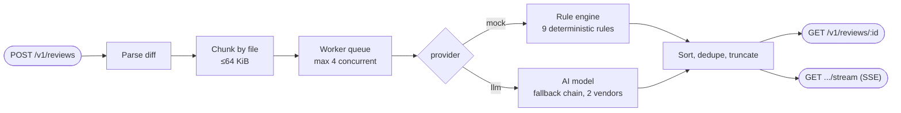

# AI Diff Review Service

**Angelina Leanore** · angelleanore@gmail.com · [LinkedIn](https://www.linkedin.com/in/angelina-leanore/)

Async HTTP service that reviews unified diffs and returns structured findings, via a **deterministic rule engine** or a **real AI model** behind the same pipeline.

> Full architecture writeup, verification methodology, and AI-tool usage notes live in **[`SUBMISSION.md`](./SUBMISSION.md)**. This file is the quick-reference version.

## How a request flows



Everything after "chunk" is provider-agnostic — chunking, ordering, dedup, caching, and streaming behave identically whichever provider is selected.

## Try the deployed service

No need to clone or run anything — the service is already live. All you need is the base URL and bearer token (shared separately at submission, not committed here):

```bash
BASE="<deployed-url>"
TOKEN="<bearer-token>"

curl -X POST "$BASE/v1/reviews" \
  -H "Authorization: Bearer $TOKEN" -H "Content-Type: application/json" \
  -d '{"diff":"diff --git a/x.ts b/x.ts\n--- a/x.ts\n+++ b/x.ts\n@@ -1,1 +1,1 @@\n+eval(userInput);\n"}'
# -> {"jobId":"...","status":"queued"}

curl "$BASE/v1/reviews/<jobId>" -H "Authorization: Bearer $TOKEN"
# -> status: "done", findings: [{ ruleId: "MOCK-001", title: "eval usage", ... }]
```

Or run the full verification suite the same way, against the live URL:

```bash
BASE="<deployed-url>" TOKEN="<bearer-token>" node test/verify.mjs
```

## Run locally (optional — not needed to evaluate the deployed service)

```bash
npm install
cp .env.example .env   # fill in AUTH_TOKEN at minimum
npm run dev             # or: npm run build && npm start
```

## The two providers

| | `mock` | `llm` |
|---|---|---|
| **What it is** | Regex/line-based rule engine, 9 fixed rules (`MOCK-001`..`008`, `MOCK-INJ`) | Real AI model call, any OpenAI-compatible vendor or Anthropic |
| **Speed** | Instant (~10ms) | Real API call, ~0.6-1.5s on Groq; each attempt capped at 8s, except the last attempt in the chain which gets whatever budget remains |
| **Determinism** | 100% — same input, same output, always | Varies run to run — real AI judgment |
| **Failure mode** | Never fails | Falls back through an ordered model chain, then (if configured) an independent second vendor; if everything fails, job → `status: "failed"` with a clear error, process never crashes |
| **Why this design** | This is what's scored — proves the pipeline works independent of any model | Only needs to exist and degrade gracefully, per the task contract |

**Models in this deployment**, primary first, each tried only after the one before it fails:

| Order | Vendor | Model |
|---|---|---|
| 1 (primary) | Groq | `llama-3.3-70b-versatile` |
| 2 | Groq | `openai/gpt-oss-120b` |
| 3 | Groq | `openai/gpt-oss-20b` |
| 4 | Groq | `llama-3.1-8b-instant` |
| 5 (cross-vendor, last resort) | OpenRouter | `openai/gpt-oss-20b:free` |

1-4 share one API (`LLM_BASE_URL`/`LLM_API_KEY`) and only fall back across *models*. 5 is a completely independent vendor/account, reached only if all of 1-4 fail — see `LLM_FALLBACK_VENDOR` below.

## Verified behaviors

Two full contract-assertion suites, a dedicated 30s-budget timing gate, and read-through demos all run against the deployed service (no code execution needed — just the URL + bearer token, exactly like an external caller):

| Suite | Checks | Covers |
|---|---|---|
| `test/verify.mjs` | 59 | Every rule, ordering/dedup, error codes, idempotency, caching, chunking, SSE replay, concurrency, rate limits, unknown-field tolerance, non-git diff shapes |
| `test/proof-scoring-criteria.mjs` | 50 | Same ground, organized 1:1 against the task's own scoring categories, plus a live `llm` call |
| `test/timing.mjs` | 13 | Every job shape (mock, llm, 5-concurrent-mock, 5-concurrent-llm) against the 30s budget, measured from submission; separates queue wait from run time and exits non-zero if anything is over |
| `test/demo*.mjs` | — | Human-readable diff-in/findings-out walkthroughs (no assertions, just readable output) |

Run any of them the same way shown above (`BASE`/`TOKEN` env vars). Running these repeatedly against the live service — and probing diff shapes the suite didn't originally cover — is what caught eight real bugs — including one that would have put `b/` into every finding's `path` and `id`, and one where the LLM timeout never applied to generation at all, letting a 15s budget produce a 46s job. Details in `SUBMISSION.md`.

## Environment variables

| Var | Required | Description |
|---|---|---|
| `PORT` | no (default 3000) | HTTP port |
| `AUTH_TOKEN` | yes | Bearer token for all `/v1/*` routes |
| `LLM_VENDOR` | no | `anthropic` for native Messages API; anything else uses OpenAI-compatible chat completions (OpenRouter, Groq, OpenAI, ...) |
| `LLM_API_KEY` | for `llm` provider | Vendor API key |
| `LLM_MODEL` | for `llm` provider | Primary (strongest) model id |
| `LLM_FALLBACK_MODELS` | no | Comma-separated fallback chain, strongest first |
| `LLM_BASE_URL` | no | API base override. This deployment uses `https://api.groq.com/openai/v1`; any OpenAI-compatible vendor works |
| `LLM_FALLBACK_VENDOR` / `LLM_FALLBACK_API_KEY` / `LLM_FALLBACK_MODEL` / `LLM_FALLBACK_BASE_URL` | no | An independent second vendor, tried only after every model on the primary vendor has failed. This deployment falls back from Groq to a second OpenRouter account, so a Groq outage or quota exhaustion doesn't fail the job outright. Inactive unless both `LLM_FALLBACK_API_KEY` and `LLM_FALLBACK_MODEL` are set |
| `LLM_TIMEOUT_MS` | no (27000) | Per-model-call ceiling for every attempt except the last, covering connect + headers + body. Set to 8000 in this deployment, tuned for Groq's speed |
| `LLM_CHAIN_BUDGET_MS` | no (28000) | Shared budget across the whole chain. Under 30s, not equal to it: the budget is measured from submission, so the job must *finish* inside 30s. Set to 25000 in this deployment |
| `JOB_BUDGET_MS` | no (30000) | The contract's own per-job budget, measured from submission — this is what `LLM_CHAIN_BUDGET_MS` is bounded against, not a separate number in practice |
| `JOB_BUDGET_SAFETY_MS` | no (2500) | Held back from `JOB_BUDGET_MS` so a budget-exhausted job still has time to record a terminal state before a client's next poll |
| `STORE_TTL_MS` | no (24h) | Age at which in-memory jobs/cache/idempotency entries are evicted |
| `STORE_SWEEP_INTERVAL_MS` | no (15min) | Eviction sweep frequency |

## Rate limiting

Token bucket, per bearer token: **30 request burst**, refilling at **30/minute**. A sustained 30 req/min always succeeds; anything beyond the burst gets `429` + `Retry-After`. GETs are never limited. Burst deliberately equals a full minute's quota so a rapid correctness-check run (one request per rule, back to back) isn't wrongly throttled.

## Project layout

```
src/
  app.ts, index.ts        Express app assembly + entrypoint
  config.ts                env-derived limits/config
  diff/parser.ts            unified diff -> per-file blocks + added lines
  diff/chunker.ts           64KiB file-boundary bin-packing
  providers/mock.ts         deterministic rule engine
  providers/llm.ts          vendor-agnostic AI call + fallback chain
  jobs/store.ts             in-memory jobs, cache, idempotency + TTL sweep
  jobs/queue.ts             concurrency-bounded worker queue
  jobs/processor.ts         parse -> chunk -> provider -> aggregate -> emit
  routes/                   health, spec, reviews, stream (SSE)
  middleware/                auth, rate limit, error handler
test/
  verify.mjs                 59-check regression suite
  proof-scoring-criteria.mjs  50-check suite mapped to the scoring rubric
  timing.mjs                  30s-budget gate: per-job timings, queue vs run
  demo*.mjs                   readable walkthroughs (mock, llm, chunking)
```

## Deployment

Always-on process on Railway — required since SSE streaming, background job processing, and in-memory state all need a persistent server, not a serverless/edge model.

## Known limitations & what's next

See `SUBMISSION.md` for the full breakdown — short version: in-memory state doesn't survive a restart, the fallback vendor is a single model rather than a full chain (if both vendors' chains are exhausted the job fails), and `MOCK-003`/`MOCK-004` use regex/brace heuristics rather than a real parser.
