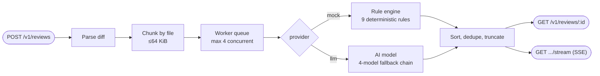

# AI Diff Review Service

Async HTTP service that reviews unified diffs and returns structured findings, via a **deterministic rule engine** or a **real AI model** behind the same pipeline.

> Full architecture writeup, verification methodology, and AI-tool usage notes live in **[`SUBMISSION.md`](./SUBMISSION.md)**. This file is the quick-reference version.

## How a request flows



Everything after "chunk" is provider-agnostic — chunking, ordering, dedup, caching, and streaming behave identically whichever provider is selected.

## Try the deployed service

No need to clone or run anything — the service is already live. All you need is the base URL and bearer token (shared separately at submission, not committed here):

```bash
BASE="<deployed-url>"
TOKEN="<bearer-token>"

curl -X POST "$BASE/v1/reviews" \
  -H "Authorization: Bearer $TOKEN" -H "Content-Type: application/json" \
  -d '{"diff":"diff --git a/x.ts b/x.ts\n--- a/x.ts\n+++ b/x.ts\n@@ -1,1 +1,1 @@\n+eval(userInput);\n"}'
# -> {"jobId":"...","status":"queued"}

curl "$BASE/v1/reviews/<jobId>" -H "Authorization: Bearer $TOKEN"
# -> status: "done", findings: [{ ruleId: "MOCK-001", title: "eval usage", ... }]
```

Or run the full verification suite the same way, against the live URL:

```bash
BASE="<deployed-url>" TOKEN="<bearer-token>" node test/verify.mjs
```

## Run locally (optional — not needed to evaluate the deployed service)

```bash
npm install
cp .env.example .env   # fill in AUTH_TOKEN at minimum
npm run dev             # or: npm run build && npm start
```

## The two providers

| | `mock` | `llm` |
|---|---|---|
| **What it is** | Regex/line-based rule engine, 9 fixed rules (`MOCK-001`..`008`, `MOCK-INJ`) | Real AI model call, any OpenAI-compatible vendor or Anthropic |
| **Speed** | Instant (~200ms) | Real API call (~10-25s) |
| **Determinism** | 100% — same input, same output, always | Varies run to run — real AI judgment |
| **Failure mode** | Never fails | Falls back through an ordered model chain; if every model fails, job → `status: "failed"` with a clear error, process never crashes |
| **Why this design** | This is what's scored — proves the pipeline works independent of any model | Only needs to exist and degrade gracefully, per the task contract |

## Verified behaviors

Two independent live test suites run against the deployed service (no code execution needed — just the URL + bearer token, exactly like an external caller):

| Suite | Checks | Covers |
|---|---|---|
| `test/verify.mjs` | 49 | Every rule, ordering/dedup, error codes, idempotency, caching, chunking, SSE replay, concurrency, rate limits |
| `test/proof-scoring-criteria.mjs` | 50 | Same ground, organized 1:1 against the task's own scoring categories, plus a live `llm` call |
| `test/demo*.mjs` | — | Human-readable diff-in/findings-out walkthroughs (no assertions, just readable output) |

Run any of them the same way shown above (`BASE`/`TOKEN` env vars). Running these repeatedly against the live service is what caught two real bugs (an undersized rate-limit burst, a false-positive regex on `=== null`) — details in `SUBMISSION.md`.

## Environment variables

| Var | Required | Description |
|---|---|---|
| `PORT` | no (default 3000) | HTTP port |
| `AUTH_TOKEN` | yes | Bearer token for all `/v1/*` routes |
| `LLM_VENDOR` | no | `anthropic` for native Messages API; anything else uses OpenAI-compatible chat completions (OpenRouter, Groq, OpenAI, ...) |
| `LLM_API_KEY` | for `llm` provider | Vendor API key |
| `LLM_MODEL` | for `llm` provider | Primary (strongest) model id |
| `LLM_FALLBACK_MODELS` | no | Comma-separated fallback chain, strongest first |
| `LLM_BASE_URL` | no | API base override (e.g. `https://openrouter.ai/api/v1`) |
| `LLM_TIMEOUT_MS` | no (20000) | Per-model-call timeout ceiling |
| `LLM_CHAIN_BUDGET_MS` | no (25000) | Shared time budget across the whole fallback chain, so cascading timeouts stay under the 30s SLA |
| `STORE_TTL_MS` | no (24h) | Age at which in-memory jobs/cache/idempotency entries are evicted |
| `STORE_SWEEP_INTERVAL_MS` | no (15min) | Eviction sweep frequency |

## Rate limiting

Token bucket, per bearer token: **30 request burst**, refilling at **30/minute**. A sustained 30 req/min always succeeds; anything beyond the burst gets `429` + `Retry-After`. GETs are never limited. Burst deliberately equals a full minute's quota so a rapid correctness-check run (one request per rule, back to back) isn't wrongly throttled.

## Project layout

```
src/
  app.ts, index.ts        Express app assembly + entrypoint
  config.ts                env-derived limits/config
  diff/parser.ts            unified diff -> per-file blocks + added lines
  diff/chunker.ts           64KiB file-boundary bin-packing
  providers/mock.ts         deterministic rule engine
  providers/llm.ts          vendor-agnostic AI call + fallback chain
  jobs/store.ts             in-memory jobs, cache, idempotency + TTL sweep
  jobs/queue.ts             concurrency-bounded worker queue
  jobs/processor.ts         parse -> chunk -> provider -> aggregate -> emit
  routes/                   health, spec, reviews, stream (SSE)
  middleware/                auth, rate limit, error handler
test/
  verify.mjs                 49-check regression suite
  proof-scoring-criteria.mjs  50-check suite mapped to the scoring rubric
  demo*.mjs                   readable walkthroughs (mock, llm, chunking)
```

## Deployment

Always-on process on Railway — required since SSE streaming, background job processing, and in-memory state all need a persistent server, not a serverless/edge model.

## Known limitations & what's next

See `SUBMISSION.md` for the full breakdown — short version: in-memory state doesn't survive a restart, the `llm` provider bounds its own processing time but not queue-wait time under heavy concurrent AI load, and `MOCK-003`/`MOCK-004` use regex/brace heuristics rather than a real parser.
