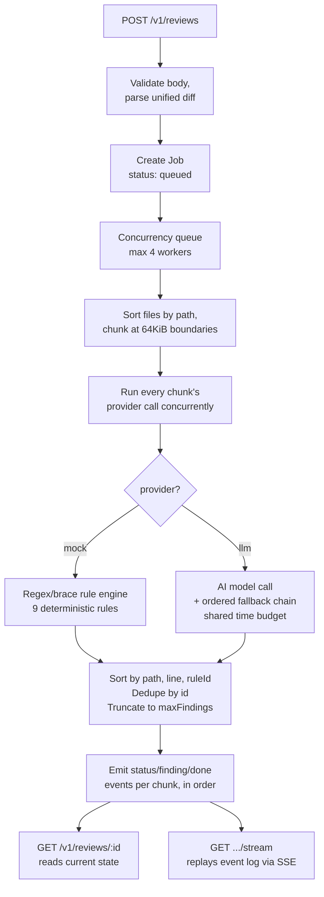

# Submission

## Architecture

- **Stack:** Node.js + TypeScript + Express, single process, in-memory state with periodic TTL eviction.
- **Diff parsing** (`src/diff/parser.ts`) tracks new-file line numbers across hunks, per file block.
- **Chunking** (`src/diff/chunker.ts`) sorts files by path first, then bin-packs on file boundaries at 64KiB — sorting first means chunk N's results are always earlier in the final ordering than chunk N+1's, so findings can stream correctly without waiting for the whole scan.
- **Concurrency** is bounded by a worker queue (`src/jobs/queue.ts`, limit 4); a 5th job queues instead of failing.
- **Idempotency and caching are two separate maps:** `Idempotency-Key` → job id (keyed on the raw request-body hash), and a semantic content hash of `{diff, resolved options}` → cached result (for `cacheHit`).
- **Streaming:** `GET /v1/reviews/:id/stream` replays a stored per-job event log to any SSE connection, whether it arrives mid-processing or after completion.

## Provider design

Both providers implement one interface — `reviewChunk(files, addedLines, lineRecordsByPath) -> Finding[]` — so chunking, ordering, dedup, caching, and streaming are identical regardless of provider; only what happens inside a chunk differs.

**`mock`**
- Pure regex/line-based rule engine, no I/O — instant and fully deterministic.
- The one rule that isn't a single-line regex, **MOCK-004 (empty catch)**, walks physical lines (added + context, in source order) from an added `catch (...) {` line, tracking brace depth until it returns to zero.
- Braces inside string literals/comments are skipped during depth tracking, so an adversarial diff can't fake a boundary.
- Covers same-line (`catch(e){}`), multi-line, and a close brace that's an unchanged context line — without a real parser.

**`llm`**
- Vendor-agnostic: any OpenAI-compatible API (OpenRouter, Groq, OpenAI) works via `LLM_BASE_URL`; `LLM_VENDOR=anthropic` switches to Anthropic's native Messages API.
- The model returns findings as a JSON array matching the `Finding` shape; the response is defensively parsed (strips markdown fences, validates each field, drops anything malformed instead of crashing).
- `LLM_FALLBACK_MODELS` is an ordered chain (strongest first), tried in sequence if the primary fails.
- The **whole chain shares one time budget** (`LLM_CHAIN_BUDGET_MS`) instead of a full timeout per model, so cascading timeouts can't blow the 30s single-chunk SLA.
- If every model in the chain fails, the job resolves to `status: "failed"` with the underlying error — the process itself never crashes.
- The prompt tells the model the diff is untrusted data, not instructions — a second layer under the mock provider's literal `MOCK-INJ` detection.

## How I verified the cross-cutting behaviors

Two independent, assertion-based suites run against the **live deployed instance** (black-box HTTP, no unit tests against internal functions — the contract is explicitly an HTTP contract):

- **`test/verify.mjs` (49 checks):** every mock rule individually (incl. same-line/multi-line/negative empty-catch cases, and negative tests for two false-positive bugs I found — see below), cross-file/cross-line ordering + no-duplicate-ids, `maxFindings` truncation vs. `usage` reflecting the full scan, the full error taxonomy, idempotency, caching, chunking on a >64KiB/4-file diff, SSE replay (finding events from a completed job's stream compared byte-for-byte against the poll endpoint's `findings`, including a cache-hit job — which didn't emit finding events at all until I went looking), 5-way concurrent submission, and rate-limit burst behavior.
- **`test/proof-scoring-criteria.mjs` (50 checks):** the same ground, reorganized 1:1 against the task's own "What we score" list, plus one live `llm`-provider call.
- **`test/demo*.mjs`:** readable (non-assertion) walkthroughs for manually eyeballing diff-in vs. findings-out, including a dedicated chunking proof that submits the same files both under and over 64KiB and diffs the resulting findings.

**Two real bugs were only found by running the suite repeatedly against the same live process:**
1. An undersized rate-limit burst (10, raised to 30 — one full minute's sustained quota) that wrongly throttled a legitimate rapid-fire correctness-check run.
2. A regex false positive: `=== null` / `!== null` was wrongly matching the loose-null-comparison rule.

Both are documented in git history rather than silently changed.

## AI tools used

- Built end-to-end with **Claude Code (Sonnet 5)** — this file included.
- Paired on the diff parser and chunker design; wrote the provider interface and mock rule table by hand-checking each regex against the spec's literal wording.
- Verified iteratively by actually running the live service and reading real HTTP responses rather than trusting the implementation on faith — several real bugs (the `=== null` false positive, an undersized rate-limit burst, a missing SSE event on cache-hit jobs) only surfaced because of that, not from reading the code.

## An AI suggestion I rejected

- While demoing the `llm` provider under concurrent load, Claude found a real gap: the 25s time budget bounds a job's own AI-processing time, but not how long it sits **queued** behind other `llm`-provider jobs if several run at once — under enough simultaneous AI traffic, a job could still blow the 30s SLA purely from queue wait.
- Claude suggested fixing it immediately: stamp each job with its queue-entry time, and subtract elapsed queue wait from its LLM budget once it starts.
- **I rejected doing it right then** — not because the fix is wrong, but because:
  - the realistic risk is low (a single evaluator's token won't generate sustained concurrent AI traffic), and
  - a nontrivial change to timing-sensitive logic, redeployed minutes before a 48-hour scoring window starts, trades a low-probability future problem for a real, immediate risk of shipping a fresh bug with no time left to catch it.
- The task explicitly invites documenting a reasoned skip over rushing a late change — so it's tracked below instead.

## What I'd do next with more time

To be clear about what these are and aren't: **neither the deterministic `mock` provider nor sourcing the `llm` path from free-tier models are limitations** — the spec requires the former and explicitly says you don't need to pay for the latter. The real limitations, independent of provider choice:

- **In-memory-only state.** A process restart mid-window (crash, platform hiccup, redeploy) loses every job's history — no persistence.
- **The `llm` provider's queue-wait time isn't bounded** (see above) — only its own per-job processing time is.
- **Regex/brace-depth heuristics for MOCK-003/004, not a real parser.** A sufficiently adversarial diff could still evade or misfire in edge cases beyond what's been tested (e.g. unusual string/comment constructs).
- **Single-process deployment.** Rate limiting and concurrency caps live in one process's memory; they wouldn't hold up across multiple instances.

**Priority order given more time:**
1. Persist job/cache/idempotency state.
2. Bound `llm` queue-wait time.
3. Replace the MOCK-003/004 heuristics with a lightweight real parser.
4. Move rate-limit/concurrency state to something shared (e.g. Redis) so the service could scale horizontally.
