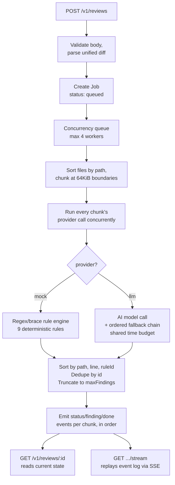

# Submission

## Architecture



- **Stack:** Node.js + TypeScript + Express, single process, in-memory state with periodic TTL eviction.
- **Diff parsing** (`src/diff/parser.ts`) tracks new-file line numbers across hunks, per file block.
- **Chunking** (`src/diff/chunker.ts`) sorts files by path first, then bin-packs on file boundaries at 64KiB — sorting first means chunk N's results are always earlier in the final ordering than chunk N+1's, so findings can stream correctly without waiting for the whole scan.
- **Concurrency** is bounded by a worker queue (`src/jobs/queue.ts`, limit 4); a 5th job queues instead of failing.
- **Idempotency and caching are two separate maps:** `Idempotency-Key` → job id (keyed on the raw request-body hash), and a semantic content hash of `{diff, resolved options}` → cached result (for `cacheHit`).
- **Streaming:** `GET /v1/reviews/:id/stream` replays a stored per-job event log to any SSE connection, whether it arrives mid-processing or after completion.

## Provider design

Both providers implement one interface — `reviewChunk(files, addedLines, lineRecordsByPath) -> Finding[]` — so chunking, ordering, dedup, caching, and streaming are identical regardless of provider; only what happens inside a chunk differs.

**`mock`**
- Pure regex/line-based rule engine, no I/O — instant and fully deterministic.
- The one rule that isn't a single-line regex, **MOCK-004 (empty catch)**, walks physical lines (added + context, in source order) from an added `catch (...) {` line, tracking brace depth until it returns to zero.
- Braces inside string literals/comments are skipped during depth tracking, so an adversarial diff can't fake a boundary.
- Covers same-line (`catch(e){}`), multi-line, and a close brace that's an unchanged context line — without a real parser.

**`llm`**
- Vendor-agnostic: any OpenAI-compatible API (OpenRouter, Groq, OpenAI) works via `LLM_BASE_URL`; `LLM_VENDOR=anthropic` switches to Anthropic's native Messages API.
- The model returns findings as a JSON array matching the `Finding` shape; the response is defensively parsed (strips markdown fences, validates each field, drops anything malformed instead of crashing).
- **The deployed chain, in order, each tried only after the one before it fails:**

  | # | Vendor | Model |
  |---|---|---|
  | 1 (primary) | Groq | `llama-3.3-70b-versatile` |
  | 2 | Groq | `openai/gpt-oss-120b` |
  | 3 | Groq | `openai/gpt-oss-20b` |
  | 4 | Groq | `llama-3.1-8b-instant` |
  | 5 (cross-vendor) | OpenRouter | `openai/gpt-oss-20b:free` |

  1-4 (`LLM_MODEL` + `LLM_FALLBACK_MODELS`) share one vendor and can only fall back across *models*. 5 (`LLM_FALLBACK_VENDOR`/`LLM_FALLBACK_API_KEY`/`LLM_FALLBACK_MODEL`) is a completely independent vendor and account, reached only if 1-4 all fail.
- Ordering of 1-4 came from measurement, not reputation: `llama-3.3-70b-versatile` was both the fastest (726ms) and among the strongest of the candidates benchmarked against the real review prompt, while `qwen/qwen3.6-27b` was dropped for emitting reasoning prose around its JSON instead of a clean array.
- The **whole chain shares one time budget** (`LLM_CHAIN_BUDGET_MS`, 25s) rather than a fresh timeout per model, and every call — connect, headers, **and body** — runs under one abort timer. That last part is load-bearing and I originally got it wrong; see bug 6 below.
- A chunk's real deadline is the tighter of that chain budget and **what remains of the job's own 30s contract budget**, which is anchored to submission time. Queue wait is therefore charged against the model call rather than added on top of it; see bug 7.
- `LLM_TIMEOUT_MS` is 8s — roughly 10x the ~0.6-1.5s a call actually takes on Groq. Deliberately not larger for a *non-final* attempt: at 8s the chain can try every Groq model and still finish inside the budget. The **last** attempt in the whole chain is the exception — it gets whatever remains of the budget rather than the 8s cap, because nothing after it needs the time saved (see bug 8).
- `LLM_FALLBACK_VENDOR`/`LLM_FALLBACK_API_KEY`/`LLM_FALLBACK_MODEL` add one call to a **second, independent vendor** at the end of the chain — tried only once every primary-vendor model has failed. This deployment falls back from Groq to a separate OpenRouter account, so a Groq outage or quota exhaustion doesn't fail the job outright. Inactive unless configured.
- If every model in the chain, across both vendors, fails, the job resolves to `status: "failed"` with the underlying error — the process itself never crashes.
- The prompt tells the model the diff is untrusted data, not instructions — a second layer under the mock provider's literal `MOCK-INJ` detection.

## How I verified the cross-cutting behaviors

Two independent, assertion-based suites, plus a dedicated budget-timing gate, run against the **live deployed instance** (black-box HTTP, no unit tests against internal functions — the contract is explicitly an HTTP contract):

- **`test/verify.mjs` (59 checks):** every mock rule individually (incl. same-line/multi-line/negative empty-catch cases, and negative tests for two false-positive bugs I found — see below), cross-file/cross-line ordering + no-duplicate-ids, `maxFindings` truncation vs. `usage` reflecting the full scan, the full error taxonomy, idempotency, caching, chunking on a >64KiB/4-file diff, SSE replay (finding events from a completed job's stream compared byte-for-byte against the poll endpoint's `findings`, including a cache-hit job — which didn't emit finding events at all until I went looking), 5-way concurrent submission, and rate-limit burst behavior.
- **`test/proof-scoring-criteria.mjs` (50 checks):** the same ground, reorganized 1:1 against the task's own "What we score" list, plus one live `llm`-provider call.
- **`test/timing.mjs` (13 job shapes):** every job shape — mock, llm, 5 concurrent mock, 5 concurrent llm — against the 30s budget measured from submission, reporting queue wait separately from run time. Exits non-zero if anything is over, so this is a gate a CI pipeline could hang a deploy on, not just a report.
- **`test/demo*.mjs`:** readable (non-assertion) walkthroughs for manually eyeballing diff-in vs. findings-out, including a dedicated chunking proof that submits the same files both under and over 64KiB and diffs the resulting findings.

**Eight real bugs were found by running against a live process rather than by reading the code:**
1. **The parser only stripped `a/`/`b/` path prefixes when the diff carried `diff --git` headers.** A hand-written unified diff (prefixes, no `diff --git` line) produced `MOCK-003:b/src/db.ts:41` instead of `MOCK-003:src/db.ts:41` — a wrong `path` and `id` on *every* finding. The prefix strip is now unconditional. This is the one I'd have most regretted missing: the suite only ever generated `git diff`-shaped input, so it was invisible until I deliberately fed the service other legal diff shapes.
2. **A deletion-only diff was rejected `422 invalid_diff`.** The "did I see a hunk?" flag was only set inside the per-file body loop, which is skipped for `+++ /dev/null` targets — so a diff that only deletes files looked unparseable. It's valid input that legitimately yields zero findings.
3. **An added line whose content began with `++`** was mistaken for a `+++` file header and dropped without advancing the line counter, shifting every subsequent line number in that file.
4. An undersized rate-limit burst (10, raised to 30 — one full minute's sustained quota) that wrongly throttled a legitimate rapid-fire correctness-check run.
5. A regex false positive: `=== null` / `!== null` was wrongly matching the loose-null-comparison rule.
6. **The LLM timeout never applied to generation.** `fetchWithTimeout` cleared its abort timer as soon as `fetch()` resolved — but `fetch()` resolves when response *headers* arrive, and an LLM vendor sends headers immediately then streams tokens. The subsequent `res.json()` read the body with no timeout at all, so the "budget" only ever bounded connection latency. A 15s chain budget was observed producing a **46s** job. The body read now stays inside the timer's scope, which makes the 30s guarantee structural instead of aspirational.
7. **Queue wait wasn't charged against the 30s budget.** The budget is per job and starts at submission, but the llm provider applied its own fixed timeout on top of however long the job had already waited for a worker. Measured in production under 5 concurrent submissions: `total=38608ms queued=11607ms` — over budget with no single slow call. Chunks now carry an absolute deadline derived from submission time. This is the fix I had explicitly *rejected* earlier in this file as low-probability; measurement proved it real, so I implemented it.
8. **The per-model timeout starved a slower fallback vendor.** Adding a second vendor (Groq -> OpenRouter) exposed this: every attempt, including the last, was capped at `LLM_TIMEOUT_MS` (8s, tuned for Groq's speed). OpenRouter's free tier needs 10-20s, so the fallback vendor was aborted before it had a real chance -- caught by deliberately simulating a Groq outage and watching the fallback call die at 8s despite ~19s still being available in the budget. The **last** attempt in the chain now gets whatever time remains rather than the fixed cap, since nothing after it needs the time saved; verified by the same simulated-outage test completing via OpenRouter in ~12s.

Each has a regression check in `verify.mjs` or `timing.mjs` (bug 8 is the exception -- reproducing a vendor outage against the live deployment isn't something I'm willing to script against production credentials, so it's a manual local procedure: start the server with a deliberately invalid primary-vendor key and a real fallback-vendor key, submit a job, confirm it completes via the fallback within budget), and is documented in git history rather than silently changed.

**Bug 6 is the one I'd most want to talk through.** It was invisible to every test that existed, because all of them asked *"did the llm path return findings?"* and none asked *"how long did it take?"* The suite was green while the service could take three times its stated budget. That gap is why `test/timing.mjs` exists now: it measures every job shape against the 30s budget from submission, reports queue wait separately from run time, and exits non-zero if anything is over — so the budget is a gate, not a hope.

**A note on how #1–#3 were found, since it's the more useful lesson:** all three are parser bugs, and all three were invisible to a 50-check suite that was *green*. The suite's diff fixtures were all built by one helper that emitted `git diff` output, so the tests agreed with the implementation about what a diff looks like. Nothing was found until I stopped asking "do my tests pass?" and started asking "what legal input have I never fed this?" — non-git diffs, `diff -u` output, deletion-only diffs, added lines that mimic diff syntax.

## AI tools used

- Built end-to-end with **Claude Code (Sonnet 5)** — this file included.
- Paired on the diff parser and chunker design; wrote the provider interface and mock rule table by hand-checking each regex against the spec's literal wording.
- Verified iteratively by actually running the live service and reading real HTTP responses rather than trusting the implementation on faith — several real bugs (the `=== null` false positive, an undersized rate-limit burst, a missing SSE event on cache-hit jobs) only surfaced because of that, not from reading the code.

## An AI suggestion I rejected

- While demoing the `llm` provider under concurrent load, Claude found a real gap: the chain time budget bounds a job's own AI-processing time, but not how long it sits **queued** behind other `llm` jobs — so a job could blow the 30s budget purely from queue wait.
- Claude suggested fixing it immediately: stamp each job with its queue-entry time and subtract elapsed queue wait from its LLM budget.
- **I rejected doing it right then**, on two grounds: the realistic risk looked low (a single evaluator's token won't generate sustained concurrent AI traffic), and a timing-sensitive change redeployed just before a scoring window trades a low-probability problem for the immediate risk of a fresh bug.

**Then I measured it, and I was wrong.** Five concurrent `llm` submissions against the deployed service produced:

```
job1: total=38608ms  queued=11607ms  status=failed    *** over the 30s budget ***
```

No single call was slow. The job simply waited 11.6s for a worker and then was handed a full-length model call on top. So I implemented the fix I'd rejected (bug 7 above), and verified it against a stub LLM that sleeps a fixed 20s — which makes the queueing exact and costs no real quota:

```
job4: total=27508ms  queued=20053ms  "timed out after 7447ms"   <- 7.4s, not a full call
```

The reasoning for the original rejection wasn't unsound — deploy risk before a scoring window is real. What was unsound was the confidence in "low probability" for something I had never measured. The honest lesson is that "unlikely" was a guess wearing the costume of a judgment call, and the measurement took ten minutes.

## What I'd do next with more time

To be clear about what these are and aren't: **neither the deterministic `mock` provider nor sourcing the `llm` path from a free tier are limitations** — the spec requires the former and explicitly says you don't need to pay for the latter. Also not a live limitation, but worth stating since it's the single biggest improvement in this submission and explains why timeout numbers in this doc changed mid-build: **vendor choice mattered more than any code I wrote.** On OpenRouter's free tier the same 3-line diff measured 19.4s, 22s (timeout), 22s (timeout), 10.6s — a coin flip, because free shared capacity is queue-dominated and model size is irrelevant to it. Moving to Groq's dedicated inference took the same work to ~0.6s, a 25-40x improvement, with no code change at all. That's resolved and deployed, not open work.

The real, still-open limitations:

- **In-memory-only state.** A process restart mid-window (crash, platform hiccup, redeploy) loses every job's history — no persistence.
- **Regex/brace-depth heuristics for MOCK-003/004, not a real parser.** A sufficiently adversarial diff could still evade or misfire in edge cases beyond what's been tested (e.g. unusual string/comment constructs).
- **The secondary vendor is one model, not a chain.** If Groq's whole chain fails and the OpenRouter fallback's single model also fails or is quota-exhausted, the job fails -- there's no third vendor. Extending `LLM_FALLBACK_*` to a list, matching the primary vendor's model+fallbackModels shape, is the natural next step.
- **Single-process deployment.** Rate limiting and concurrency caps live in one process's memory; they wouldn't hold up across multiple instances.
- **The rate limiter can contaminate unrelated test results.** With burst = 30 and refill = 30/min, any client issuing more than 30 POSTs inside a minute starts getting `429`s — including a caller who is really testing caching or chunking and merely happens to be fast. I watched this happen to my own probe run. The behavior is exactly what the contract asks for (sustained 30/min succeeds, beyond burst is `429` + `Retry-After`, never 5xx) and `/spec` declares it honestly, so I left it: raising the burst would make `rateLimitPerMinute: 30` a less truthful self-declaration, and the contract weights declared-limit accuracy explicitly. It is a real sharp edge worth naming rather than hiding.

**Priority order given more time:**
1. Persist job/cache/idempotency state.
2. Extend the secondary vendor to a full fallback chain, not a single model.
3. Replace the MOCK-003/004 heuristics with a lightweight real parser.
4. Move rate-limit/concurrency state to something shared (e.g. Redis) so the service could scale horizontally.

(Bounding `llm` queue-wait time was on this list until it was measured, found real, and fixed — bug 7 above.)
